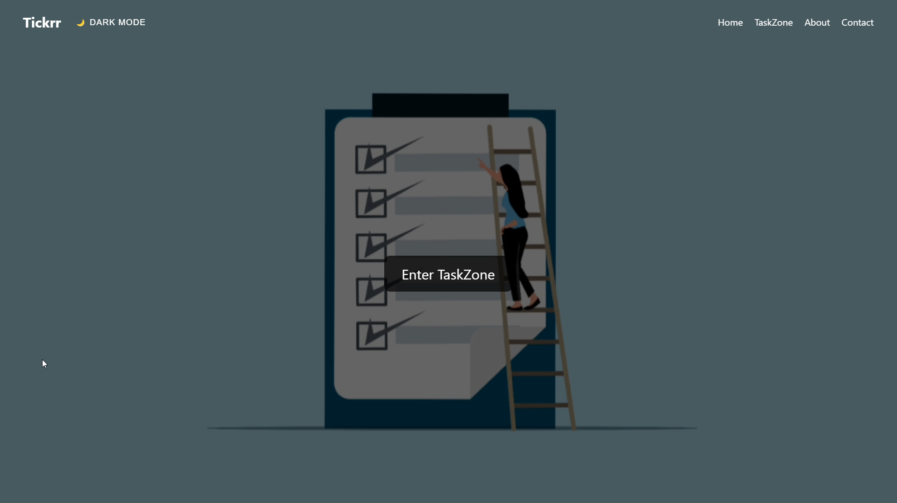
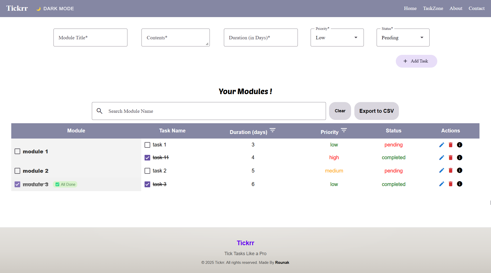
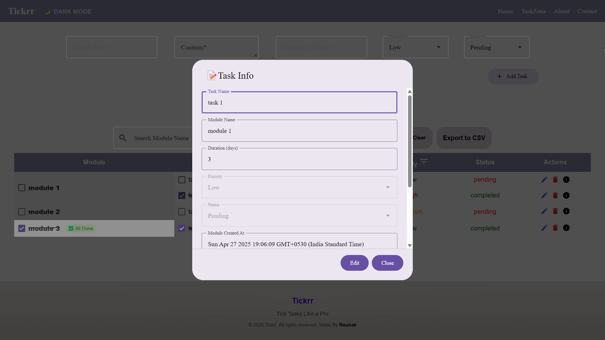
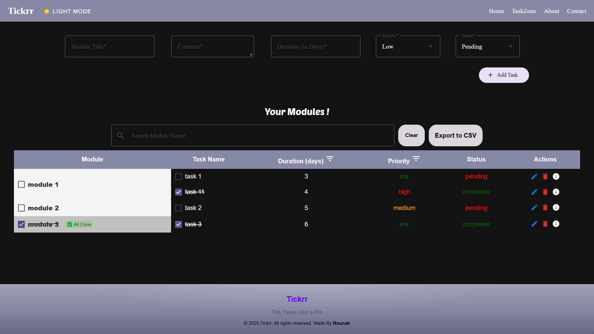

# [Tickrr - A Task Management Application](https://tickrr-task-management-application.vercel.app/)

Welcome to **Tickrr** — a sleek, Material Design-inspired onboarding task management app built using **Vue 3**, **Pinia**, Vue Router, and **Vite**!

## 🚀 Features

- **Add New Tasks** with:
  - Module Name (Text)
  - Contents (Multi-line Text)
  - Duration (Number - Days)
  - Priority (Low / Medium / High)
  - Status (Pending / Completed)
- **Display Tasks** in a clean, responsive table:
  - Columns: Module | Contents | Duration | Priority | Status | Actions
- **Edit Tasks** (via Modal)
- **Delete Tasks**
- **Mark Tasks as Complete** (Completed tasks move to the bottom)
- **Sort Tasks**:
  - By Priority
  - By Duration
- **Search/Filter Tasks** by Module Name
- **Form Validation** to ensure input correctness
- **Task History Log**:
  - Capture Created / Updated / Completed timestamps
- **Local Storage** Persistence
  - Abstracted through a service layer (repository pattern)
- **State Management** using **Pinia**
- **Material Design 3 UI**
- **Responsive Design** for mobile, tablet, and desktop
- SPA using Vue Router

---

## 🌟 Bonus Features

- **Dark Mode Toggle** (Pinia-managed)
- **Export Tasks to CSV**